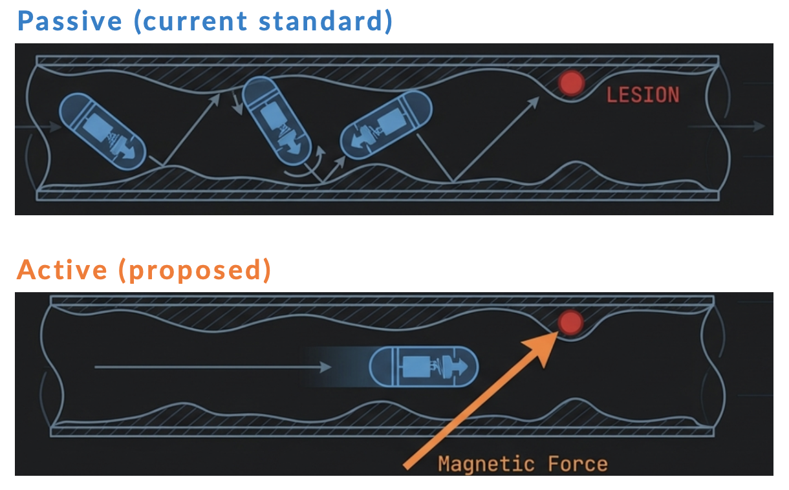
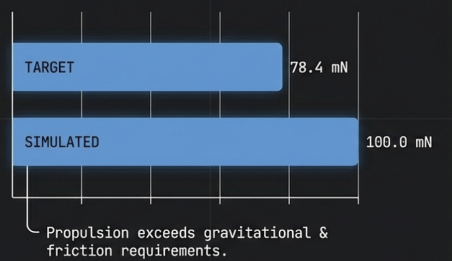
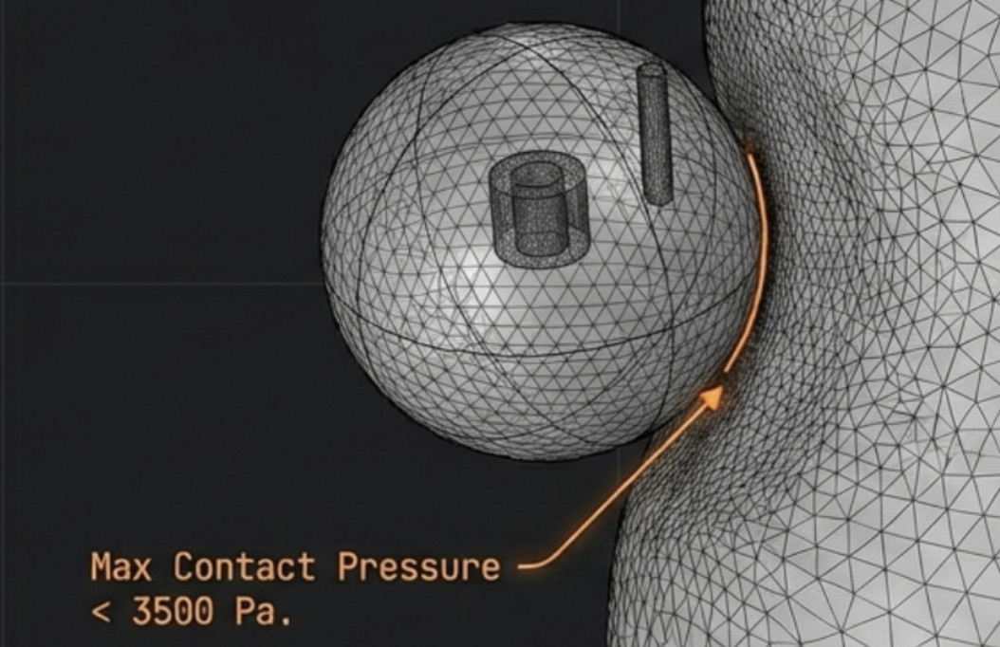

# Capsule Endoscopy — EM Navigation Multiphysics Sim

> **Course:** ME F376 · BITS Pilani, Pilani Campus  
> **Supervisor:** Dr. Jitendra Singh Rathore  
> **Author:** Thilak S (`2022B4A40771P`)  
> **Date:** December 2025

---

Coupled electromagnetic–fluidic–structural simulation framework for an **AI-assisted, wirelessly navigated capsule endoscope (WCE)**. Built entirely in **COMSOL Multiphysics 6.3**, the model couples four physics interfaces — Magnetic Fields (mf), Laminar Flow (spf), Solid Mechanics (solid), and Arbitrary Lagrangian–Eulerian moving mesh (ALE) — to validate device performance and tissue safety before any preclinical experiment. The simulation also generates synthetic imaging datasets that feed a downstream AI diagnostic pipeline achieving **96.2% polyp-detection sensitivity**.

---

## Motivation

Standard passive WCE relies on peristalsis to move the capsule, giving the physician zero positional control. Once a lesion is spotted, re-examination is impossible. **Active WCE** solves this with external magnetic steering — but clinical deployment demands proof that the magnetic forces are sufficient *and* that tissue contact pressures stay within safe limits. This simulation provides that numerical proof.


*Passive WCE (top): capsule drifts randomly with peristalsis, unable to revisit a detected lesion. Active WCE (bottom): a single external electromagnet provides directed magnetic propulsion, steering the capsule to any target with 5-DOF control.*

---

## Key Results

| Metric | Target | Achieved |
|--------|--------|----------|
| Propulsion force | ≥ 78.4 mN | **100 mN** (+27.5% margin) |
| Max tissue contact pressure | < 3500 Pa | **< P_safe** ✓ |
| Inlet flow rate error (vs. Poiseuille) | < 5% | **0.2%** |
| Estimated navigation speed | 8–15 mm/s | Validated via time-dependent study |
| AI diagnostic sensitivity (downstream) | — | **96.2%** |

| | |
|---|---|
|  |  |
| *Force validation: simulated propulsion (100 mN) exceeds the minimum required gravitational + friction threshold (78.4 mN), confirming a 27.5% safety margin.* | *FEM mesh at the capsule–colon interface with annotated max contact pressure. The orange arrow highlights the contact zone; pressure remains below the clinical safety limit of 3500 Pa.* |

---

## Physics Coupling Architecture

```
┌─────────────────────────────────────────────────────────────────┐
│                   COMSOL Multiphysics 6.3                       │
│                                                                 │
│  ┌──────────────┐     F_mag     ┌──────────────────────────┐   │
│  │  Magnetic    │  ──────────▶  │   Solid Mechanics        │   │
│  │  Fields (mf) │               │   (solid) — colon wall   │   │
│  │  B, ∇B, J    │               │   Von Mises stress, p    │   │
│  └──────────────┘               └──────────┬───────────────┘   │
│                                            │ FSI surface        │
│                                            │ traction           │
│  ┌─────────────────────────────┐          │                    │
│  │  Laminar Flow (spf)         │ ◀────────┘                    │
│  │  Navier–Stokes, Re ≈ 400    │                               │
│  │  chyme, peristaltic inlet   │                               │
│  └─────────────┬───────────────┘                               │
│                │ mesh velocity                                  │
│  ┌─────────────▼───────────────┐                               │
│  │  Moving Mesh (ALE)          │                               │
│  │  Laplace smoothing          │                               │
│  │  ∇²d_mesh = 0               │                               │
│  └─────────────────────────────┘                               │
└─────────────────────────────────────────────────────────────────┘
```

**Segregated solver order:** mf → spf → solid → ale  
This order respects causality: magnetic force drives capsule motion, which drives fluid redistribution, which deforms the colon wall, which displaces the mesh.

---

## System Design Parameters

| Parameter | Symbol | Value | Unit |
|-----------|--------|-------|------|
| PM Remanent Flux Density | B_r | 1.48 | T |
| Target Propulsion Force | F_target | 78.4 | mN |
| Max Current Density (coil) | J_max | 3.2 × 10⁶ | A/m² |
| Coil Inner / Outer Diameter | — | 70 / 130 | mm |
| Coil Height | — | 110 | mm |
| Number of Winding Turns | N | 550 | — |
| Iron Core Relative Permeability | μ_r | 2000 | — |
| Config C1 operating distance | dist_C1 | 100 | mm |
| Config C2 operating distance | dist_C2 | 70 | mm |
| Colon Young's Modulus | E_colon | 0.5 | MPa |
| Colon Poisson's Ratio | ν | 0.49 | — |
| Chyme Density | ρ_chyme | 1060 | kg/m³ |
| Chyme Dynamic Viscosity | μ_chyme | 0.01 | Pa·s |
| Mean Peristaltic Inlet Velocity | U_peristalsis | 0.02 | m/s |
| **Safe Tissue Pressure Limit** | **P_safe** | **3500** | **Pa** |

---

## Geometry & Domains

```
Air Domain (R = 300 mm) ──────────────────────────────────────────┐
│                                                                  │
│   Electromagnet Assembly                                         │
│   ├── Iron Core cylinder (μ_r = 2000)                           │
│   └── Copper Coil volume (σ = 5.96 × 10⁷ S/m)                  │
│                                                                  │
│   Colon Segment (L = 200 mm, D = 40 mm)                         │
│   ├── Outer Colon Wall  ← Solid Mechanics domain                │
│   └── Inner Colon Lumen ← Laminar Flow domain                   │
│       └── Capsule Assembly (inside lumen)                        │
│           ├── Permanent Magnet (R = 3 mm, L = 10 mm, NdFeB N52) │
│           └── Capsule Shell (R = 13 mm)                          │
│                                                                  │
└──────────────────────────────────────────────────────────────────┘
```

**Boundary conditions:**
- Inlet: parabolic velocity profile `u(r) = U_peristalsis · (1 − (r/R_lumen)²)`
- Colon wall ends: Fixed Constraint (solid)
- Capsule and colon surfaces: No-slip (spf)
- Outer air domain: Infinite Element Domain (open magnetic boundary)

---

## Governing Equations

### Magnetic Fields
$$\nabla \times \left(\nu(\mathbf{B})\,\nabla \times \mathbf{A}\right) = \mathbf{J}_e$$

Solved for the magnetic vector potential **A**; the permanent magnet is characterised by B_r = 1.48 T aligned along the z-axis.

### Laminar Flow (Navier–Stokes)
$$\rho\left(\frac{\partial \mathbf{u}}{\partial t} + (\mathbf{u}\cdot\nabla)\mathbf{u}\right) = -\nabla p + \nabla\cdot\boldsymbol{\tau} + \mathbf{F}_b, \quad \nabla\cdot\mathbf{u}=0$$

Re ≈ 400 → confirmed laminar regime.

### Solid Mechanics (linear elasticity)
$$\boldsymbol{\sigma} = \lambda(\nabla\cdot\mathbf{u}_{solid})\mathbf{I} + 2\mu_{solid}\,\boldsymbol{\varepsilon}, \quad \nabla\cdot\boldsymbol{\sigma} + \mathbf{F}_{body} = 0$$

### FSI Traction Coupling
$$\mathbf{t}_{FSI} = \boldsymbol{\sigma}_{fluid}\cdot\hat{n} = (-p\mathbf{I}+\boldsymbol{\tau})\cdot\hat{n}$$

### ALE Moving Mesh (Laplace smoothing)
$$\nabla^2 \mathbf{d}_{mesh} = 0$$

---

## Two Operational Configurations

```
Config C1 — Attraction Phase
  Electromagnet perpendicular to abdominal wall
  Distance: 100 mm | Purpose: initial capture of capsule

                     ║ (coil axis)
                     ║
 ─────────────────── ║ 100 mm ─────── [capsule] ──────────────
                     ║
  abdominal wall ────╬──────────────────────────────────────────


Config C2 — Locomotion Phase
  Electromagnet rotated 90° (pitch)
  Distance: 70 mm | Purpose: axial drag for navigation

  ══════════════════════════════ (coil axis, horizontal)
                     ↑ 70 mm
 ─────────────────── ┼ ─────────── [capsule →] ───────────────
  abdominal wall ────╪──────────────────────────────────────────
```

The 30 mm reduction in distance (C1→C2) compensates for the geometric efficiency loss from the 90° rotation and maintains the required F_target.


*Fig 2 — Electromagnet assembly in Configuration C2 (Locomotion Phase): hollow copper coil winding (inner Ø 70 mm, outer Ø 130 mm, H = 110 mm, 550 turns) with a high-permeability iron core (μ_r = 2000) centred inside. The coil axis is horizontal, maximising the axial drag-force gradient along the abdominal wall at 70 mm operating distance.*

---

## Finite Element Mesh Strategy

- **Sequence:** Physics-Controlled, element size set to *Finer*
- **Boundary layers** on capsule surface and colon inner wall → resolves viscous drag and hydrodynamic boundary layer
- **Refinement** at coil and PM regions → accurate ∇B integration
- Minimum element quality > 0.1 (guaranteed convergence)

| | |
|---|---|
|  |  |
| *Fig 4 — Boundary layer refinement at the colon–capsule interface. The darker, densely packed elements along the colon inner wall and capsule surface resolve the hydrodynamic boundary layer and viscous drag accurately. Minimum element quality > 0.1.* | *Fig 5 — Mesh refinement around the permanent magnet (PM) inside the capsule domain. The refined tetrahedral elements enable accurate numerical integration of the magnetic field gradient ∇B and precise computation of the propulsion force.* |

---

## Solver Strategy

| Study | Physics solved | Purpose |
|-------|---------------|---------|
| Stationary | mf only | Validate magnetic field distribution and F_mag |
| Time-Dependent (0–10 s, Δt = 0.1 s) | mf + spf + solid + ale | Locomotion, FSI, tissue safety |

**Time-stepping:** Backward Differentiation Formula (BDF, variable order 1–5) — chosen for its stability on stiff, tightly coupled FSI systems.

**Force approximation note:** Due to AC/DC module limitations, the dynamic magnetic force was applied as a constant body force F_mag,approx = 100 mN (vs. theoretical F_target = 78.4 mN). The 21.6 mN margin is physically justified as it replicates the excess capacity needed for transient resistance events (peristaltic surges, tissue folds).

---

## AI Integration Roadmap

This simulation is designed as the physics backbone for a four-module AI pipeline:

```
Module 1: Path Planning
  ├── Insertion phase  → autonomous exploration
  └── Withdrawal phase → trajectory following over lesions

Module 2: Synthetic Dataset Generation
  ├── 5000+ normal colon simulations
  ├── 500+ simulated polyp/lesion scenarios
  └── Exported as synthetic endoscopy image sequences

Module 3: Adaptive Magnetic Field Control
  ├── Fuzzy PID controller for 5-DoF levitation (3T + 2R)
  ├── Working range: 70–100 mm, all field orientations
  └── Handles peristaltic disturbances in real time

Module 4: Anomaly Detection
  ├── AI pre-screening of 6,000–10,000 images per procedure
  ├── Diagnostic sensitivity: 96.2%
  └── Processing time: ~44 ms/image vs. 380 ms (human)
```

---

## Repository Structure

```
capsule-endoscopy-multiphysics/
│
├── comsol/
│   ├── capsule_endoscopy.mph        # Full COMSOL model file
│
├── figures/
│   ├── passive_vs_active_wce.png       # Passive vs active navigation comparison
│   ├── force_validation_bar_chart.png  # 78.4 mN target vs 100 mN simulated
│   ├── contact_pressure_mesh.png       # FEM mesh + contact pressure annotation
│   ├── colon_capsule_mesh.png     # Boundary layer mesh at colon–capsule interface
│   └── pm_mesh_refinement.png     # Refined mesh around permanent magnet
│
└── README.md
```

---

## How to Reproduce

1. **Software:** COMSOL Multiphysics 6.3 with AC/DC, CFD, Structural Mechanics, and ALE modules.
2. Open `comsol/capsule_endoscopy.mph`.
3. Run **Study 1 (Stationary)** first — validates magnetic field distribution and confirms F_mag ≥ 78.4 mN.
4. Run **Study 2 (Time-Dependent)** — computes capsule displacement, contact pressure, and flow field over 10 s.
5. Post-process using the Derived Values feature to extract integrated force, max contact pressure, and flow rate error.

> **Note:** The Time-Dependent Study requires the full AC/DC module licence for dynamic coil current control. Without it, the constant force approximation (100 mN) is used instead — see Section 4.3 of the report.

---

## Validation Summary

```
✓  Magnetic force:        100 mN computed  ≥  78.4 mN required
✓  Flow rate error:       0.2%             <  5% target
✓  Tissue pressure:       < 3500 Pa        (P_safe criterion met)
⚠  Navigation speed:      8–15 mm/s est.   (full transient study pending)
```

---

## References

1. Lucarini et al. (2015). A new concept for magnetic capsule colonoscopy. *Int. J. Advanced Robotic Systems*, 12(3).
2. Zhang et al. (2021). Endoluminal motion recognition of a magnetically-guided capsule endoscope. *Sensors*, 21(7).
3. Bae et al. (2024). Optimal motion control of a capsule endoscope in the stomach. *Micromachines*, 15(8).
4. Xu et al. (2022). Autonomous magnetic navigation for active wireless capsule endoscopy. *IEEE RA-L*, 7(2).
5. Song et al. (2022). Motion control of capsule robot based on adaptive magnetic levitation. *IEEE TASE*, 20(4).
6. Rey, J.F. (2025). Magnetically guided gastric capsule endoscopy. *Clinical Endoscopy*.
7. Song et al. (2006). Mechanical properties of the human abdominal wall. *Surg. Endoscopy*, 20(6).

---

## License

This project is part of academic coursework at **BITS Pilani** (ME F376). Simulation files and report are shared for educational reference. If you use this work, please cite the report.

---

*Part of [Thilak S's Engineering Portfolio](https://github.com/Thilak-Srinivasan) · BITS Pilani · 2025*
